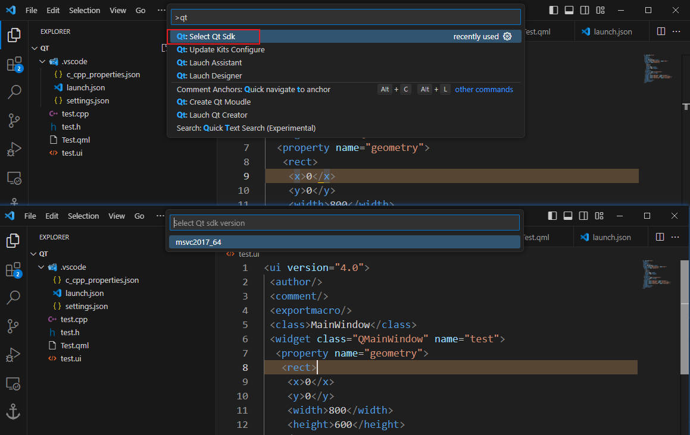

# 简介

`Qt Servitor` 插件的开发目的是在 vscode 中辅助 Qt 项目的构建，插件功能包括
- 自动配置 `launch.json` 文件，便于 Qt 程序的运行与调试；
- 自动配置 `c_cpp_properties.json`，使得 [c/c++ extension](https://marketplace.visualstudio.com/items?itemName=ms-vscode.cpptools) 插件能正确识别 Qt 相关头文件
- Qt sdk 版本切换；
- Qt 模块自动生成；
- `assistant.exe`、`designer.exe`、`linguist.exe` 与 `qtcreator.exe` 的快捷启动。

# 声明

> 该插件只支持 `windows` 与 `linux` 操作，且未对 `linux` 进行过测试 （目前没有测试环境，有时间再测了）。

参考项目：
- [C/C++ Extension](https://marketplace.visualstudio.com/items?itemName=ms-vscode.cpptools)
- [Qt visual Studio Tools](https://github.com/qt-labs/vstools)
- [Qt Tools](https://marketplace.visualstudio.com/items?itemName=tonka3000.qtvsctools)

# 配置

**[必选参数]**

- `qt.installPath` : 指定 Qt 的安装位置，例如 `D:/ProgramData/Qt/Qt5.12.12`

**[可选参数]**

- `qt.qtCreatorPath` : 指定 `qtcreator.exe` 的所在路径，例如 `D:/ProgramData/Qt/Qt5.12.12/Tools/QtCreator/`

- `qt.sdkPath` :指定 Qt 项目所使用的 sdk 版本，例如 `D:/ProgramData/Qt/Qt5.12.12/5.12.12/msvc2017_64`

- `qt.qtnatvis` : 指定 `qt.natvis.xml` 的路径。该文件来自 [Qt visual Studio Tools](https://github.com/qt-labs/vstools)，可以在原工程项目中[下载](https://github.com/qt-labs/vstools/blob/dev/QtMSBuild/QtMsBuild)。

- `qt.includePath` : 指定 Qt 的头文件，例如 `D:/ProgramData/Qt/Qt5.12.12/5.12.12/msvc2017_64/include`

# 使用

## 创建模块

选择 `Create Qt Moudle` 进入模块选择界面，选择需要的模型进行创建
- Qt Mainwindow 
- Qt Widget
- Qt Dialog
- Qt Object : 支持 QObject, QWidget, QDialog, QMainWindow 类型的创建
- Qt Designer Form : 创建 `.ui` 文件
- Qt Resource File : 创建 `.qrc` 文件
- Qt QML File : 创建 `.qml` 文件

## 快捷启动

选择目标文件 -> 右键 -> 选择打开方式。不同的文件会对应不同的启动工具。

## sdk 版本切换

在命令面板搜索 `Qt: Select Qt Sdk`。使用该命令后，便能进行 sdk 版本选择。

## 更新配置

更新 `launch.json` 与 `c_cpp_properties.json` 的配置，需要结合插件 [c/c++ extension](https://marketplace.visualstudio.com/items?itemName=ms-vscode.cpptools) 一起使用。

# 日志信息

