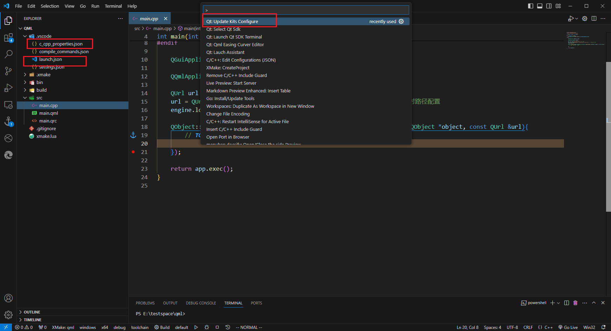

# 配置

# settings.json

## 配置项

```term
triangle@LEARN:~$ pwd
D:/ProgramData/Qt/  // Qt 的安装目录
triangle@LEARN:~$ tree
.
│── 5.15.2  // sdk 目录
│    ├── msvc2015_64
│    ├── msvc2017_64
│    ├── msvc2019_64
│    └── wasm_32
├── Docs
    ...
├── Tools  // qtcreator.exe 所在目录
    ...
└── vcredist
```

| 选项               | 必选   | 描述                                                                                                                                                                                              |
| ------------------ | ------ | ------------------------------------------------------------------------------------------------------------------------------------------------------------------------------------------------- |
| `qt.installPath`   | **是** | 指定 Qt 的安装位置，例如 `D:/ProgramData/Qt/`                                                                                                                                                     |
| `qt.qtCreatorPath` | 否     | 指定 `qtcreator.exe` 的所在路径，例如 `D:/ProgramData/Qt/Tools/QtCreator/`                                                                                                                        |
| `qt.sdkPath`       | 否     | 指定项目所使用的 SDK 版本，例如 `D:/ProgramData/Qt/5.15.2/msvc2017_64`                                                                                                                            |
| `qt.qtnatvis`      | 否     | 指定 `qt.natvis.xml` 的路径。该文件来自 [Qt visual Studio Tools](https://github.com/qt-labs/vstools)，可以在原工程项目中[下载](https://github.com/qt-labs/vstools/blob/dev/QtMSBuild/QtMsBuild)。 |
| `qt.includePath`   | 否     | 指定 Qt 的头文件，例如 `D:/ProgramData/Qt/5.15.2/msvc2017_64/include`                                                                                                                             |

## 优先级


当在 `.vscode/settings.json` 中设置了 `qt.installPath` ，将优先使用 `workspace` 中的配置，而非全局 `settings.json`。

# sdk 版本切换


在命令面板搜索 `Qt: Select Qt Sdk`。使用该命令后，便能进行 sdk 版本选择。

# Kit 配置





更新 `launch.json` 与 `c_cpp_properties.json` 中的相关 Qt 配置，需要结合插件 [c/c++ extension](https://marketplace.visualstudio.com/items?itemName=ms-vscode.cpptools) 一起使用。


