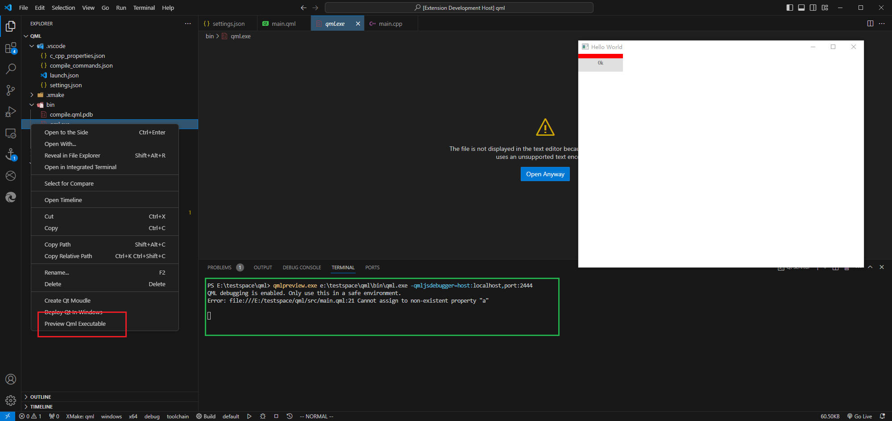

# QML 支持

# 预览
## 单文件预览


对选中的 `.qml` 进行预览，不支持实时。会在 `Qt Servitor` 终端展示预览结果信息，且一次只能预览一个 `.qml` 文件。

## 目标文件预览



对选中的 `Quick` 应用进行预览，支持对 `Debug` 版的实时预览（修改项目`.qml`后，能实时展示修改结果）。

> 想要对 `Debug` 版应用的`.qml`进行实时预览，不能使用 `qrc:/` 路径

```cpp
#include <QGuiApplication>
#include <QQmlApplicationEngine>

int main(int argc, char *argv[])
{
#if QT_VERSION >= 0x50601
    QCoreApplication::setAttribute(Qt::AA_EnableHighDpiScaling);
#endif

    QGuiApplication app(argc, argv);

    QQmlApplicationEngine engine;
    
    // NOTE - 不能使用
    // QUrl url = QUrl("qrc:/main.qml"); 

    // 本地绝对路径配置
    QUrl url = QUrl::fromLocalFile("E:/testspace/qml/src/main.qml"); 
    engine.load(url);

    return app.exec();
}
```


# 其他

> 施工中。。。。

