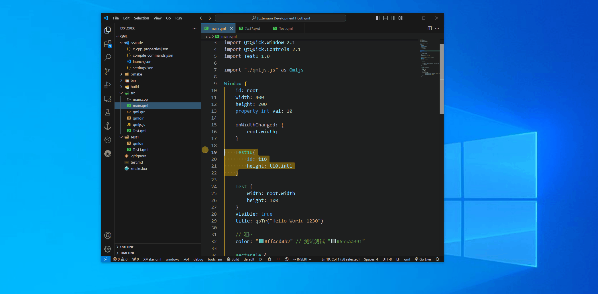
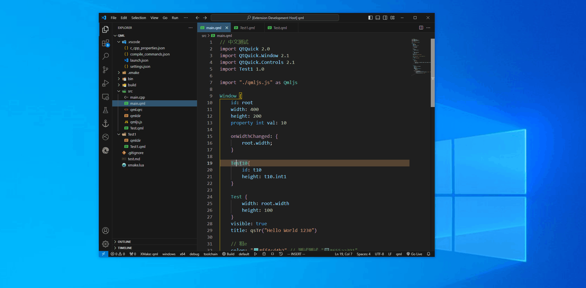

# QML 支持

# 语言

## 功能

遵守 `LSP` 语言服务协议，实现了 `QML` 基本语言特性，包括
- 语法静态检测
- 拾色器
- 智能补全
- 定义跳转
- 变量重命名
- 引用查找
- 格式化

## 语法高亮

支持 `qml` 在 `markdown` 中语法高亮

> 若语法高亮不正常，对 `.qml` 文件进行格式化后，则能正确展示

## 取色器

目前只能识别两种颜色设置
- `"#RRGGBB"`
- `"#AARRGGBB"`

## 语法检测

> **TIP**  
> 由于底层实现限制，语法检测可能没有自动刷。可以 `ctrl + s` 保存当前文档，实现强制刷新。

## 自动补全

## 定义跳转

## 查找引用

## 格式化

## 重命名

# 预览
## 单文件预览

对选中的 `.qml` 进行预览，不支持实时。会在 `Qt Servitor` 终端展示预览结果信息，且一次只能预览一个 `.qml` 文件。

## 实时预览

在 `c_cpp_properties.json` 中配置好 `qt.targetFile` 目标程序，便能对 `qml` 进行实时预览。

> **NOTE**  
> 1. 若要实时预览目标可执行文件，目标文件必须开启了 `debug` 模式。可以通过宏 `QT_DECLARATIVE_DEBUG、QT_QML_DEBUG` 开启，详情见 [Debugging QML Applications](https://doc.qt.io/qt-6/qtquick-debugging.html)
> 2. 在使用预览工具前，**需要保证工程项目能正常编译、目标可执行文件可运行。**

