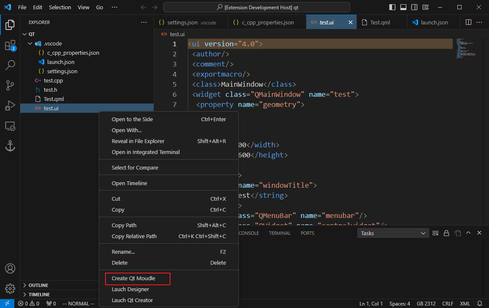
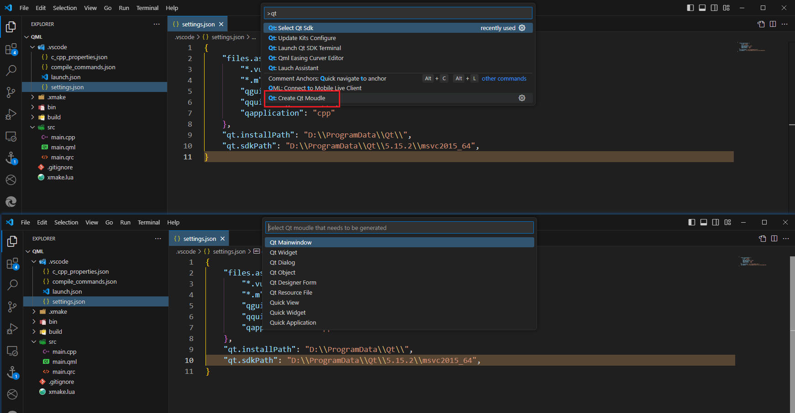
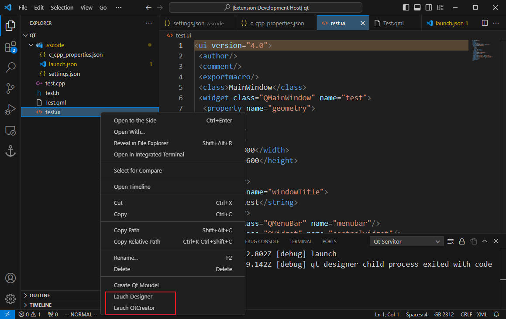
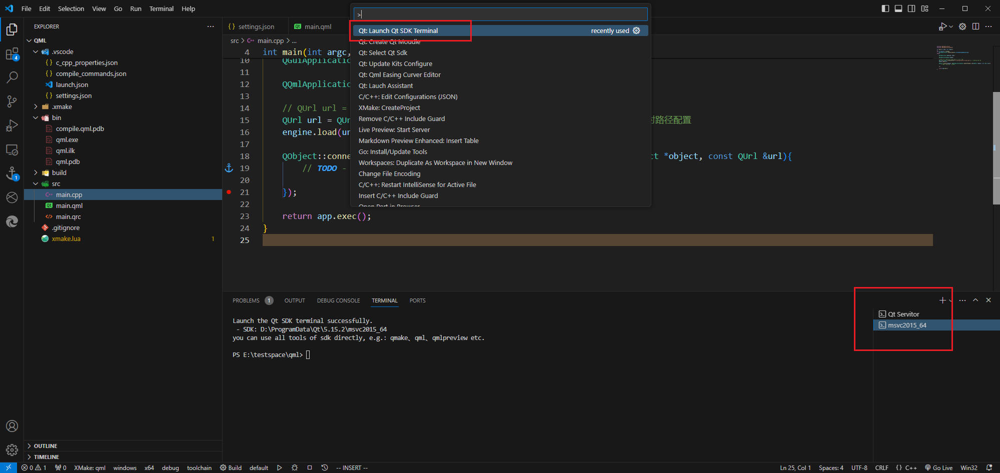
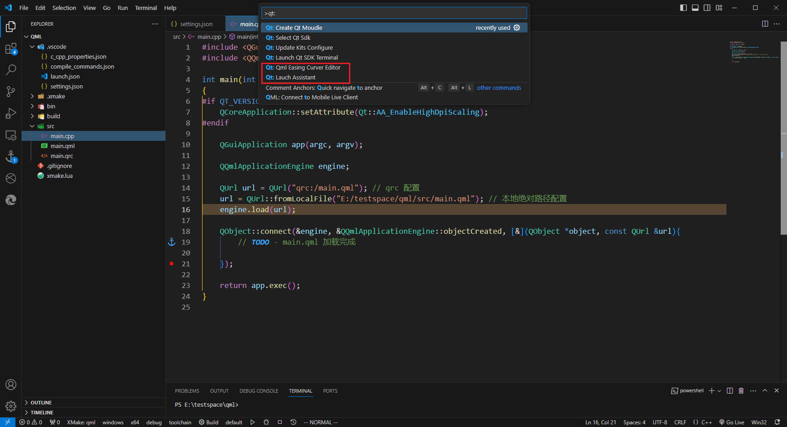
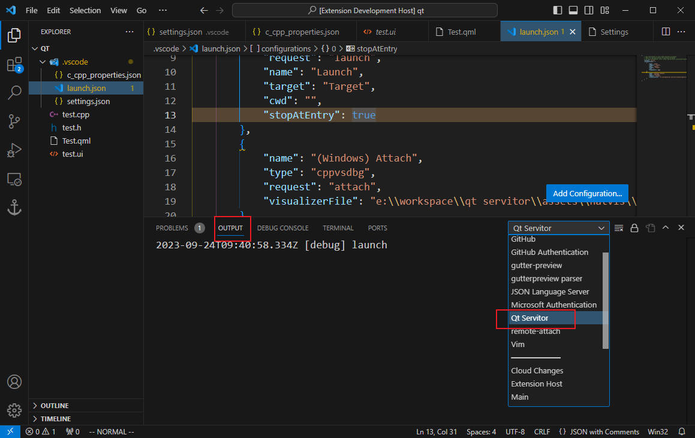

# 工具集

# 创建模块

选择 `Create Qt Moudle` 进入模块选择界面，选择需要的模型进行创建
- Qt Mainwindow 
- Qt Widget
- Qt Dialog
- Qt Object : 支持 QObject, QWidget, QDialog, QMainWindow 类型的创建
- Qt Designer Form : 创建 `.ui` 文件
- Qt Resource File : 创建 `.qrc` 文件
- Quick View: 创建 `QQuickView` 项目模板
- Quick Widget: 创建 `QQuickWidget` 项目模板
- Quick Application: 创建 `QGuiApplication` 项目模板

# 快捷启动

不同的文件会对应不同的启动工具

| 工具              | 支持文件                                 |
| ----------------- | ---------------------------------------- |
| `QtCreator.exe`   | `.qml、.pro、.ui、.ts、.qrc`             |
| `linguist.exe`    | `.ts`                                    |
| `windeployqt.exe` | 无限制，但需要是 `.dll` 与 `.exe` 类文件 |
| `designer.exe`    | `.ui`                                    |
| `qml.exe`         | `.qml`                                   |
| `qmlpreview.exe`  | `.exe`                                   |

# 终端

`Qt: Launch Qt SDK Terminal` 可以根据 `Qt: Select Qt Sdk` 选择版本生成 SDK 终端，并可以在终端中直接使用 `qmake、qml、qmlpreview` 等命令行工具。

# 辅助工具

- `Lauch Assistant` : 帮助文档
- `Qt:Qml Easing Curver Editor` : 辅助 qml 动画调节

# 日志

